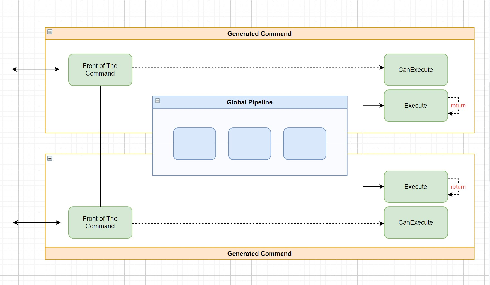

# Abstract
이 프로젝트는 Application에서 Domain, Application Rules, Business Rules 혹은 Business Logic과 같은것들의 명령 단위 캡슐화를 지원합니다. 명령에 대한 표현은 Command pattern이 사용됩니다.

이것은 Usecase Layer, Domain Service Layer 그리고 CQRS 구축의 일부분이 될 수 도 있습니다.

Web, CLI, GUI Application 등 어느 하나에 중점을 두지 않고 범용적으로 사용할 수 있습니다.

구현부에서는 .Net 5에서 소개된 Source Generator를 활용합니다.
Source Generator와 같은 메타프로그래밍을 적절히 활용한다면 정통 프로그래밍에서 제공할 수 없었던 유연한 소스 코드를 제공할 수 있습니다.
이것은 컴파일 시점에 소스코드를 생성하여 주입하기 때문에 여러분이 직접 작성한 소스 코드와 동일한 효과를 갖습니다.

이 프로젝트의 이름은 Plastic 입니다.

<br>

# Quick Start
Step 1. 커맨드 작성합니다.
```cs
// [CommandName("AddCommand")]
class AddCommandSpec : CommandSpecificationBase<AddParam, AddResponse>
{
        public AddCommandSpec(IMyCalculator calculator)
        { ... }

        public override Task<AddResponse> ExecuteAsync(
                AddParam param, CancellationToken token = default)
        { ... }
        
        public override Task<Response> CanExecuteAsync(
                AddParam param, CancellationToken token = default)
        { return CanBeExecuted(); }
}
```

Step 2. IServiceCollection에 Plastic을 추가합니다.
```cs
// ------
void Configure(IServiceCollection services)
{
        var pipelineBuilder = new BuildPipeline(...);

        services.UsePlastic(pipelineBuilder);
}
```
Step 3. 생성자 주입을 통해 사용합니다.
```cs
// ------
class AddController : ControllerBase
{
        public AddController(AddCommand addCommand)
        {
                ...
                var result = addCommand.Execute( ... );
        }
}
```

<br>

# 명령의 흐름
아래는 명령의 흐름을 설명합니다.


<br>

# Command
Application들은 일반적으로 사용자로부터 명령을 받아 그것을 처리합니다.
이것은 때때로 Usecase라고 불리우고 있습니다.

Command pattern은 개체가 명령 그 자체라는 매우 단순한 Design pattern입니다.
Usecase들은 Application의 명령을 다루기에, 이 Command pattern으로 표현하기에 적절합니다.

Plastic은 이러한 Command들을 작성할 수 있도록 지원합니다. 또한 .Net의 Source Generator를 활용하여 보다 유연한 소스 코드를 제공합니다. 이를 통해 보다 더 나은 사용성을 기대할 수 있습니다.

아래는 Plastic에서 Command 작성을 위한 최상위 추상화입니다.
```cs
public interface ICommandSpecification<in TParam, TResult>
{
    Task<TResult> ExecuteAsync(TParam param, CancellationToken token = default);
    Task<Response> CanExecuteAsync(TParam param, CancellationToken token = default);
}
```

Plastic은 해당 추상화의 구현체를 바탕으로 사용가능한 Command를 생성합니다.
> 생성된 Command에는 전역 파이프라인이 포함된 Souce code가 구성됩니다.
> 전역 파이프라인에 대한 상세한 내용은 이후 이어지는 내용에서 다루도록 합니다.

그러나 Plastic에서 위와 같은 추상체를 직접적으로 사용할 수 없습니다.

구현체는 아래와 같은 몇가지 Base class들을 통해 가능합니다.
```cs
public abstract class ParameterlessCommandSpecificationBase
        : ICommandSpecification<NoParameters?, ExecutionResult> { }

public abstract class ParameterlessCommandSpecificationBase<TResult>
        : ICommandSpecification<NoParameters?, ExecutionResult<TResult>> { }

public abstract class CommandSpecificationBase<TParam, TResult>
        : ICommandSpecification<TParam, ExecutionResult<TResult>> { }
        
public abstract class CommandSpecificationBase<TParam>
        : ICommandSpecification<TParam, ExecutionResult> { }
```
이러한 Base class들을 통해 다양한 시나리오의 Command를 작성할 수 있습니다.

또한 Base class들에서 사용된 몇가지 개체들은 아래와 같습니다.
* NoParameter <br>
파라메터 없음을 나타냅니다. 파라메터가 없는 Command들을 위해 사용됩니다.

* Response <br>
일반적으로 CanExecuteAsync의 반환 타입입니다. 가능 여부를 위한 boolean과 message 속성을 포함합니다.

* ExecutionResult <br>
ExecuteAsync의 반환 타입으로써 실행 성공 여부를 나타냅니다.

* ExecutionResult&#60;T&#62; <br>
ExecutionResult와 같은 용도지만 결과 값을 포함할 수 있습니다. 실행에 실패하면 이 결과 값은 null입니다.

이러한 Base Class들을 상속받고 지정된 abstract method들을 작성합니다.
> 상속된 class의 이름에 접미사로 'CommandSpec'을 사용해주세요. Plastic은 그를 인지하여 알맞는 이름으로 Command를 생성합니다. 또는 `CommandNameAttribute`을 통해 생성될 Command의 이름을 지정할 수 있습니다.

이후 Compile하면 명세를 바탕으로 모든 Command들이 자동 생성됩니다.

> `ExecuteAsync`는 내부에서 `CanExecuteAsync`를 호출하여 실행이 가능할때 실행됩니다.

<br>

# 파이프라인 (Pipeline)
모든 Command들은 특정한 `전역 파이프라인 (Global Pipeline)`을 거친 후 실행됩니다. <br>
이 파이프라인을 구성함으로써 보다 나은 기능성을 기대할 수 있습니다.

Logging, Business transaction, Integration event와 같은 시나리오들을 이 파이프라인에서 프로세싱할 수 있습니다.

`abstract class Pipe`를 상속받아 한개의 Pipe를 작성할 수 있습니다.

아래는 Sample에서 사용되어진 Pipe 구현의 예입니다.
```cs
public class LoggingPipe : Pipe
{
        ...
        public async override Task<ExecutionResult> Handle(
                PipelineContext context, Behavior<ExecutionResult> nextBehavior, CancellationToken token)
        {
                this._logger.LogInformation(context.Parameter?.ToString());

                ExecutionResult result = await nextBehavior.Invoke().ConfigureAwait(false);

                this._logger.LogInformation(result.ToString());

                return result;
        }
}
```
이렇게 작성된 Pipe들은 `AddPlastic(PipelineBuilder builder)`를 통해 주입할 수 있습니다.

> Pipeline은 `Asp.net`의 pipeline 실행 흐름과 동일합니다. 또한, 이에 영감 받은 `MediatR`과도 동일합니다.


Pieline에서 주목해야할 점은 `PipelineContext`에 있습니다.
이 Context에는 Pipe에서 사용할 수 있는 모든 데이터가 준비되어 있습니다.

* Parameter <br>
Command에서 사용될 Parameter 인스턴스입니다.

* CommandSpec <br>
실행 될 CommandSpec Type입니다.

* Services <br>
실행 될 CommandSpec이 생성자 주입으로 필요로 하는 Service들의 Instance들입니다.
이 Instance는 실제로 CommandSpec의 생성자로 주입됩니다.

<br>

# 강한 결합 (Coupling)
Command들은 모두 구현체 그대로 노출 됩니다. <br>
테스트, 다른 구현체 사용 등등 과 같은 명목으로 적용되는 낮은 결합(Low Coupling)은 Plastic에서 배제됩니다.
 
Domain Service를 구축하는 사례를 보면 대개 추상화를 통한 낮은 결합 (Low Coupling)을 이루려고 합니다.
허나 Plastic에서 Command들은 이것의 바깥 Layer인 Consumer측에 강하게 결합되기를 희망합니다.

대개 바깥 Layer는 오직 이 layer를 사용하기 위해 만들어진 영역입니다. 약하게 결합될 이유가 없습니다.
이 말은 이러한 Layer 없이 존재할 이유가 없다라는 것과 같습니다.

Plastic은 바깥 Layer가 명령의 변경사항에 민감하게 반응하기를 희망합니다.

<br>

# 명시적 종속성 
다양하게 수많은 Command들을 손쉽게 다루기 위한 방법으로 Mediator 혹은 Service Locator와 같은 방법을 생각해낼 수 있습니다.
그러나 이는 개체의 명시적 종속을 위반합니다.

등가 교환으로 이 명시적 종속성 위반을 품에 안을 수 있습니다.
하지만 Plastic은 이 명시적 종속성을 지키고 싶습니다.

이를 위해 .Net 5에서 소개된 Source Generator 를 활용합니다.
이를 통해 사용성과 명시적 종속성, 이 두가지를 모두 제공합니다.

<br>

# 이름에 대하여...
일상 생활에서 Plastic은 대부분 무언가를 보호하기 위해 사용되는 깨지기 쉬운 재질입니다.
프로젝트 Plastic은 소비측의 안쪽 Layer를 보호하기 위해 만들어졌기에 이렇게 작명되었습니다.

<br>

# 마치며
이 프로젝트는 아주 새로운 것이 아닙니다.
지금까지 흔하게 접해온 개념들을 잘 조합하는 것이 목표입니다.
