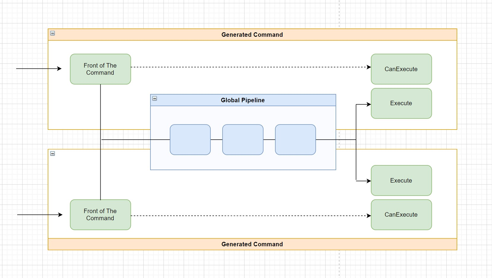


[](https://github.com/sang-hyeon/Plastic/actions/workflows/github_actions.yml)
[](https://www.nuget.org/packages/Plastic/)

# Abstract
This project provides encapsulation of things like Domain, Application Rules, Business Rules or Business Logic in Application. Command pattern has used for this.

All applications such as Web, CLI, GUI application can use this project.
This can be part of the Usecase Layer, Domain Service Layer or CQRS.

The source generator introduced in .Net 5 is used to implement this Idea. If metaprogramming such as Source generator is properly used, it's possible to provide flexible source code that has not been provided by traditional programming.
Generated source code has the same effect as the source code you wrote yourself because it will be injected at compile time.

The name of this project is Plastic.

<br>

# Quick Start
```cs
// [CommandName("AddCommand")]
class AddCommandSpec : CommandSpecificationBase<AddParam, AddResponse>
{
        public AddCommandSpec(IMyCalculator calculator)
        { ... }

        public override Task<AddResponse> ExecuteAsync(
                AddParam param, CancellationToken token = default)
        { ... }
        
        public override Task<Response> CanExecuteAsync(
                AddParam param, CancellationToken token = default)
        { return CanBeExecuted(); }

}
// ------
void Configure(IServiceCollection services)
{
        var pipelineBuilder = new BuildPipeline(...);

        services.UsePlastic(pipelineBuilder);
}
// ------
class AddController : ControllerBase
{
        public AddController(AddCommand addCommand)
        {
                ...
                addCommand.Execute( ... );
        }
}

```

<br>

# Flow of Plastic

